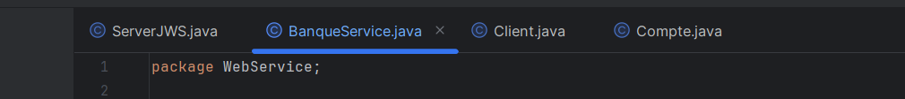
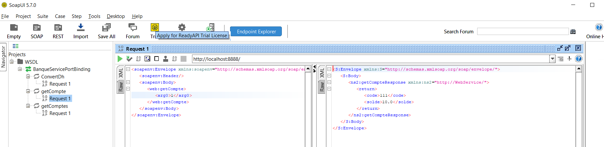

<h1>Web Service</h1> 

Web service qui permet de :

<ul>
  <li>Convertir un montant de l’auro en DH</li>
  <li>Consulter un Compte</li>
  <li>Consulter une Liste de comptes</li>
</ul>

Web service avec un simple Serveur JaxWS

url= http://0.0.0.0:8888/

analyser le WSDL avec un Browser HTTP

Tester les opérations du web service avec un outil SoapUI

Client SOAP Java

